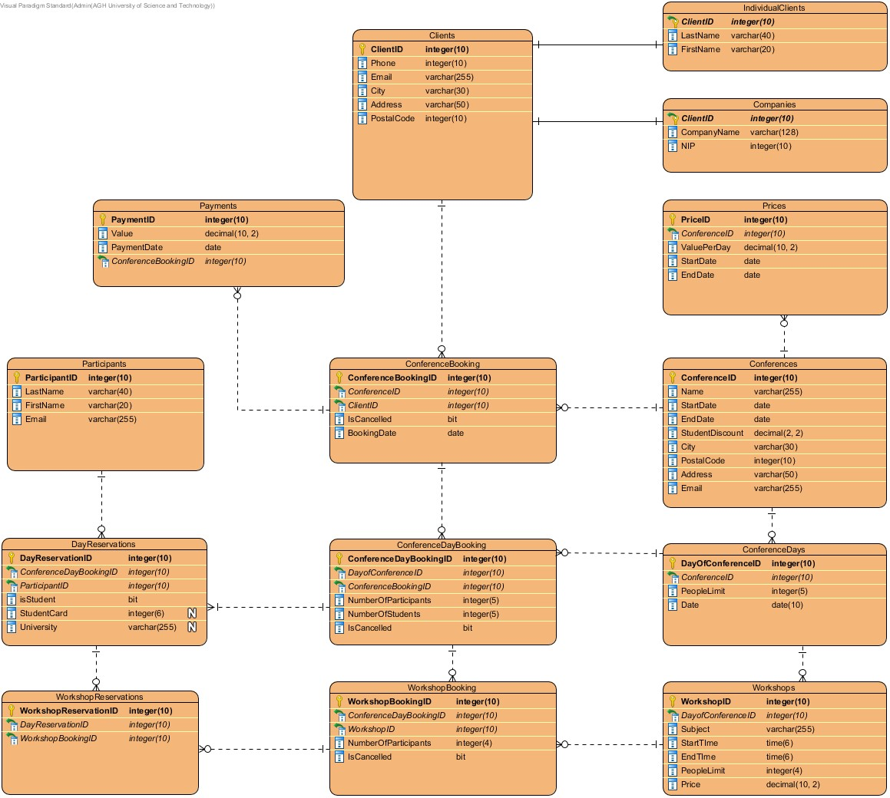

During third semester of my studies I completed course Databases Beginnings. During classes I realised with Mateusz Nabywaniec the project "Conferences". The aim of this task is to develop database that would help the company that is organising conferences. We had to create for example labels, procedures and triggers. After that we had to test our system with real data and this program could generate complex data.

Database schema:

